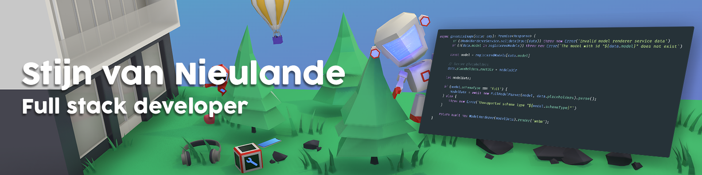

<!-- This file is automatically generated. -->

<table style="width: 100%; border: none;" border="0" cellspacing="0" cellpadding="0">
<tbody>
<tr>
<td>
Hello 
  
I'm Stijn, full stack developer from  <strong>The Netherlands</strong>. 
I like to work on random projects in my spare time and want to discover more and more new things over time. I also like to listen to music while working and have an addiction to watching things on YouTube.
   

</td>
<td width="320">

</td>
</tr>
</tbody>
</table>

### &nbsp;&nbsp; Technologies and tools i'm using

### &nbsp;&nbsp; My GitHub statistics
<small>**Note:** Most statistics are just a metric made up of my public code and not a reflection of experience or skill level.</small>

More GitHub statistics

